# 📊 Ads V2 — ERD Diagram (Entity-Relationship)

> **الحالة:** مسودة لاعتماد التاجر  
> **التاريخ:** 2026-06-24  
> **الملاحظة:** كل المجموعات بـ prefix `ads_v2_` ومستقلة عن V1.

---

## 1. النموذج البياني (Mermaid ER Diagram)

```mermaid
erDiagram
    USERS ||--o{ ADS_V2_FEATURE_FLAGS : "has_one"
    USERS ||--o{ ADS_V2_OAUTH_CREDENTIALS : "owns"
    USERS ||--o{ ADS_V2_ACCOUNTS : "owns"
    USERS ||--o{ ADS_V2_CURRENCY_SETTINGS : "configures"

    ADS_V2_OAUTH_CREDENTIALS ||--o{ ADS_V2_ACCOUNTS : "authorizes"
    ADS_V2_ACCOUNTS ||--o{ ADS_V2_SYNC_RUNS : "is_synced_by"
    ADS_V2_ACCOUNTS ||--o{ ADS_V2_SPEND_RAW : "produces"
    ADS_V2_ACCOUNTS ||--o{ ADS_V2_SPEND_DAILY : "aggregates_to"

    ADS_V2_SYNC_RUNS ||--o{ ADS_V2_SPEND_RAW : "writes"

    ADS_V2_SPEND_RAW }o--|| ADS_V2_SPEND_DAILY : "rolled_into"

    ADS_V2_CURRENCY_SETTINGS ||--o{ ADS_V2_SPEND_DAILY : "provides_fx_for"

    ADS_V2_SPEND_DAILY ||--|| ADS_V2_RECONCILIATION : "validated_by"
    ADS_V2_RECONCILIATION ||--|| ADS_V2_SPEND_REVIEW : "promotes_to"
    ADS_V2_SPEND_REVIEW ||--o| ADS_V2_LEDGER_POSTINGS : "posts_to"
    ADS_V2_LEDGER_POSTINGS ||--|| GENERAL_LEDGER : "writes_legs_in"

    ADS_V2_SPEND_REVIEW ||--o{ ADS_V2_REVIEW_HISTORY : "tracked_by"
    ADS_V2_LEDGER_POSTINGS ||--o{ ADS_V2_REVERSALS : "may_be_reversed_by"

    USERS {
        string id PK
        string email
        string role
    }

    ADS_V2_FEATURE_FLAGS {
        string user_id PK
        bool v2_enabled
        bool v2_reports_replace_v1
        bool v1_writes_disabled
        datetime enabled_at
    }

    ADS_V2_OAUTH_CREDENTIALS {
        string id PK
        string user_id FK
        enum provider
        string organization_id
        string organization_name
        string access_token_enc
        string refresh_token_enc
        datetime token_expires_at
        list scopes_granted
        enum status
    }

    ADS_V2_ACCOUNTS {
        string id PK
        string user_id FK
        string oauth_credential_id FK
        enum provider
        string external_account_id
        string display_name
        string currency_native
        string timezone
        string organization_id
        bool bank_fee_enabled
        float bank_fee_rate_pct
        float bank_fee_flat_amount
        enum bank_fee_method
        enum sync_status
        datetime last_sync_finished_at
        date last_synced_date
    }

    ADS_V2_CURRENCY_SETTINGS {
        string id PK
        string user_id FK
        string from_currency
        string to_currency
        float rate
        date effective_from
        date effective_to
        enum source
    }

    ADS_V2_SYNC_RUNS {
        string id PK
        string user_id FK
        string account_id FK
        enum provider
        enum trigger
        enum status
        datetime started_at
        datetime finished_at
        int rows_inserted_raw
        int rows_updated_daily
        string error_summary
    }

    ADS_V2_SPEND_RAW {
        string id PK
        string user_id FK
        string account_id FK
        string source_run_id FK
        enum provider
        string date
        enum granularity
        dict dimension_keys
        float spend_native
        string currency_native
        int impressions
        int clicks
        string provider_payload_hash
        datetime fetched_at
    }

    ADS_V2_SPEND_DAILY {
        string id PK
        string user_id FK
        string account_id FK
        enum provider
        string date
        float spend_native
        string currency_native
        float fx_rate_to_sar
        string fx_rate_source
        date fx_rate_as_of
        float spend_sar
        float bank_fee_sar
        float gross_sar
        enum confidence
        enum data_health
        datetime last_recomputed_at
    }

    ADS_V2_RECONCILIATION {
        string id PK
        string user_id FK
        string account_id FK
        string date
        float spend_daily_total
        float platform_reported_total
        float drift_amount
        float drift_pct
        list anomaly_flags
        enum recon_status
        bool late_reporting_detected
        datetime checked_at
    }

    ADS_V2_SPEND_REVIEW {
        string id PK
        string user_id FK
        string account_id FK
        string date
        string reconciliation_id FK
        float spend_native
        string currency_native
        float fx_rate_to_sar
        float spend_sar
        float bank_fee_sar
        float gross_sar
        enum review_status
        list review_flags
        datetime created_at
        datetime decided_at
        string decided_by
        string idempotency_key
    }

    ADS_V2_REVIEW_HISTORY {
        string id PK
        string review_id FK
        enum action
        enum from_status
        enum to_status
        string actor_user_id
        string note
        datetime at
    }

    ADS_V2_LEDGER_POSTINGS {
        string id PK
        string review_id FK
        string txn_group_id FK
        string user_id FK
        string account_id FK
        string date
        list legs_summary
        datetime posted_at
        string posted_by
    }

    ADS_V2_REVERSALS {
        string id PK
        string original_posting_id FK
        string reversal_txn_group_id
        string reason
        datetime reversed_at
        string reversed_by
    }

    GENERAL_LEDGER {
        string id PK
        string txn_group_id
        enum entry_type
        string user_id
        string entity_type
        string entity_id
        enum side
        float amount
        dict metadata
        datetime posted_at
    }
```

---

## 2. العلاقات المهمة (شرح نصي)

| العلاقة | الكاردِناليتي | المعنى |
|---|---|---|
| `ads_v2_oauth_credentials` → `ads_v2_accounts` | 1 : N | كل token يخدم حسابات منظمة واحدة. **هذا يحلّ مشكلة الرياض:** كل organization تحتاج credential منفصل. |
| `ads_v2_accounts` → `ads_v2_spend_raw` | 1 : N | حساب واحد ينتج صفوف خام كثيرة (يومية × dimensions) |
| `ads_v2_spend_raw` → `ads_v2_spend_daily` | N : 1 | السطور الخام تُجمَّع في صف يومي واحد |
| `ads_v2_currency_settings` → `ads_v2_spend_daily` | N : N | السعر السارّي وقت الترحيل يُحفظ في daily |
| `ads_v2_spend_daily` → `ads_v2_reconciliation` | 1 : 1 | كل (account, date) فيه سجل reconciliation واحد |
| `ads_v2_reconciliation` → `ads_v2_spend_review` | 1 : 1 | المراجعة لا تُنشأ إلا بعد reconciliation pass |
| `ads_v2_spend_review` → `ads_v2_ledger_postings` | 1 : 0..1 | المراجعة المُعتمَدة تنتج posting واحد |
| `ads_v2_ledger_postings` → `general_ledger` | 1 : N | كل posting يكتب 2-3 legs في GL |
| `ads_v2_ledger_postings` → `ads_v2_reversals` | 1 : 0..N | يمكن عكس وإعادة عكس |

---

## 3. القيود (Integrity Constraints)

| القيد | كيف يُفرَض |
|---|---|
| لا حساب بدون credential صالح | عند إنشاء `ads_v2_accounts` يجب تمرير `oauth_credential_id` (إلا للحسابات اليدوية بـ `oauth_credential_id=null` و `sync_status='manual'`) |
| لا review بدون reconciliation pass | `ads_v2_spend_review.reconciliation_id` NOT NULL |
| لا posting بدون review approved | `ads_v2_ledger_postings.review_id` يشير لسطر بـ `review_status='approved'` |
| لا double-post | `ads_v2_spend_review.idempotency_key` UNIQUE + GL يفحص نفس المفتاح |
| لا حذف تاريخ | `ads_v2_spend_raw` و `ads_v2_review_history` و `ads_v2_reversals` كلها append-only |

---

## 4. خريطة Indexes (Performance)

| Collection | Index | الغرض |
|---|---|---|
| `ads_v2_accounts` | `{user_id, provider, external_account_id}` unique | منع تكرار الحساب |
| `ads_v2_oauth_credentials` | `{user_id, provider, organization_id}` unique | منع تكرار token لنفس organization |
| `ads_v2_spend_raw` | `{user_id, account_id, date, source_run_id, dimension_keys}` unique | append-only مع تتبع run |
| `ads_v2_spend_raw` | `{user_id, account_id, date, fetched_at:-1}` | قراءة آخر snapshot |
| `ads_v2_spend_daily` | `{user_id, account_id, date}` unique | يوم واحد لكل حساب |
| `ads_v2_spend_daily` | `{user_id, date, confidence}` | تقارير سريعة |
| `ads_v2_reconciliation` | `{user_id, account_id, date}` unique | 1:1 مع daily |
| `ads_v2_spend_review` | `{user_id, account_id, date}` unique | منع double review |
| `ads_v2_spend_review` | `{user_id, review_status, created_at:-1}` | queue queries |
| `ads_v2_spend_review` | `{idempotency_key}` unique | منع double post |
| `ads_v2_currency_settings` | `{user_id, from_currency, to_currency, effective_from:-1}` | lookup سريع |
| `ads_v2_sync_runs` | `{user_id, started_at:-1}`, `{status}` | logs |
| `ads_v2_ledger_postings` | `{review_id}` unique, `{txn_group_id}` | audit lookup |

---

## 5. ما الذي **لا** يدخل في الـ ERD

- ❌ لا علاقة مع `counterparties` (V2 مستقل تماماً). الحسابات الإعلانية في V2 لها جدولها الخاص.
- ❌ لا علاقة مع `meta_ads_daily` أو `snapchat_account_daily` (V1 يُترك ساكناً).
- ❌ لا علاقة مع `ad_account_ledger` (V1 سيُستعاض عنه بـ V2 reads من GL).
- ✅ علاقة وحيدة مع V1: قراءة `general_ledger` للأرصدة (لأن GL هو SSOT العام للتطبيق).

---

**✍️ التعديلات المطلوبة من التاجر:** ضع علامة على أي علاقة / جدول / حقل تريد تعديله قبل اعتماد ERD نهائياً.
