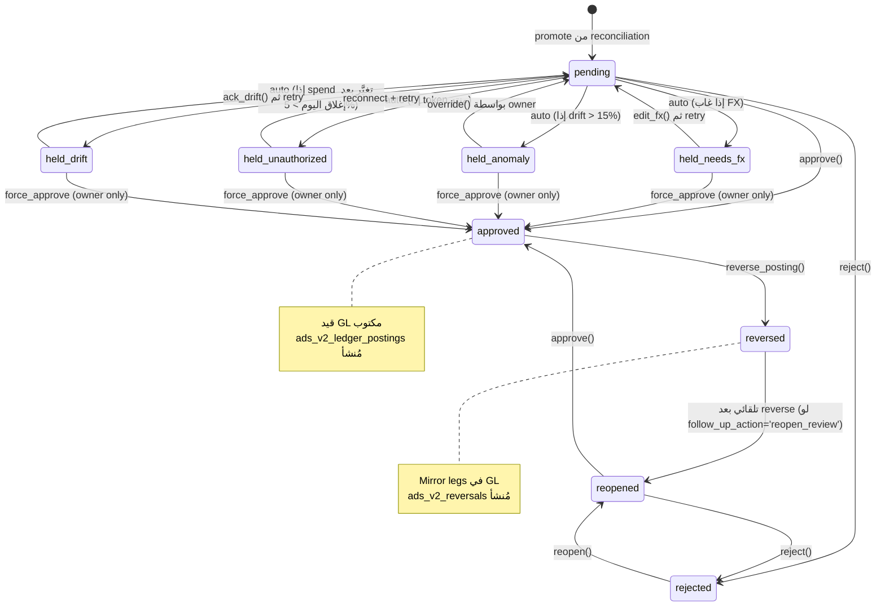

# 🔄 Ads V2 — Review Workflow

> **الحالة:** مسودة لاعتماد التاجر  
> **التاريخ:** 2026-06-24

---

## 1. State Machine (آلة الحالات)



---

## 2. الحالات السبعة (تفصيل)

| الحالة | المعنى | الإجراءات المتاحة | لون UI |
|---|---|---|---|
| `pending` | جاهز للمراجعة، بدون مشاكل | approve, reject, edit_fx | 🟡 أصفر |
| `held_needs_fx` | لا fx_rate سارٍ لتاريخ السطر | edit_fx, force_approve, reject | 🟠 برتقالي |
| `held_anomaly` | drift > 15% مع platform أو WoW spike | override, force_approve, reject | 🔴 أحمر |
| `held_unauthorized` | OAuth token منتهٍ أو منظمة غير مربوطة | reconnect → retry, force_approve, reject | 🔴 أحمر |
| `held_drift` | الرقم تغير بعد إغلاق اليوم > 5% | ack_drift → retry, force_approve, reject | 🟠 برتقالي |
| `approved` | معتمَد ومُرحَّل لـ GL | reverse_posting (يعكس) | 🟢 أخضر |
| `rejected` | مرفوض | reopen | ⚫ رمادي |
| `reopened` | فُتح مرة أخرى بعد رفض | approve, reject | 🔵 أزرق |
| `reversed` | كان معتمَداً ثم عُكس | reopen (تلقائياً لو follow_up='reopen_review') | 🟣 بنفسجي |

---

## 3. التحويلات (Transitions) المفصَّلة

### 3.1 Auto: reconciliation → review (Promotion)

**المُحفِّز:** `POST /ads-v2/reconciliation/promote` أو cron يومي 02:00 الرياض.

**القاعدة:**

```python
for each ads_v2_spend_daily WHERE confidence='final' 
    AND NOT EXISTS ads_v2_spend_review(account_id, date):
    
    recon = ads_v2_reconciliation(account_id, date)
    if recon is None:
        # تأكَّد من recon قبل أي promote
        continue
    
    # تحديد الحالة الابتدائية حسب recon
    if recon.recon_blocked_review:
        continue  # لا تنشئ review حتى يُرفع الحجز
    
    flags = []
    initial_status = "pending"
    
    if daily.data_health == "missing_fx":
        initial_status = "held_needs_fx"
        flags.append("missing_fx")
    
    if "drift_above_15pct" in recon.anomaly_flags:
        initial_status = "held_anomaly"
        flags.append("drift_above_15pct")
    
    if account.sync_status == "unauthorized":
        initial_status = "held_unauthorized"
        flags.append("unauthorized")
    
    if "post_close_change" in recon.anomaly_flags:
        initial_status = "held_drift"
        flags.append("post_close_change")
    
    INSERT ads_v2_spend_review(
        status=initial_status,
        review_flags=flags,
        snapshot من daily,
        reconciliation_id=recon.id
    )
    
    LOG ads_v2_review_history(action='create', to_status=initial_status)
```

### 3.2 User Action: `pending|reopened|held_*` → `approved`

**Endpoint:** `POST /ads-v2/review/{id}/approve`  
**Role:** owner | admin | accountant

**Pre-checks:**
1. ✓ Review موجود وحالته في القائمة المسموحة
2. ✓ لو الحالة `held_*` → يجب تمرير `force=true` و الدور يجب أن يكون `owner`
3. ✓ Idempotency: لو الـ `idempotency_key` موجود في GL بـ status=`posted` → يُرجَع بـ 409 Conflict

**Steps (transactional):**
1. Compute final amounts من snapshot الموجود في review
2. Build legs للترحيل (راجع Posting Workflow)
3. INSERT في GL داخل txn_group_id جديد
4. INSERT في `ads_v2_ledger_postings`
5. UPDATE review: `status='approved', decided_at, decided_by, posted_txn_group_id, posting_id`
6. LOG في `ads_v2_review_history(action='approve')`

**Failure handling:** أي خطوة فشلت → rollback كامل (no GL row, no posting row, review لا يتغير).

### 3.3 User Action: `pending|reopened|held_*` → `rejected`

**Endpoint:** `POST /ads-v2/review/{id}/reject`  
**Role:** owner | admin | accountant  
**Body:** `{ note: "Required reason" }` (مطلوب)

**Steps:**
1. UPDATE review: `status='rejected', decision_note, decided_at, decided_by`
2. LOG في history
3. لا تأثير على GL

### 3.4 User Action: `rejected` → `reopened`

**Endpoint:** `POST /ads-v2/review/{id}/reopen`  
**Role:** owner | admin  
**Body:** `{ note: "Re-investigating" }`

**Steps:**
1. UPDATE review: `status='reopened', previously_rejected_at, reopen_count += 1`
2. **مسح** `decided_at` و `decided_by` (للاحتفاظ بـ history في separate log)
3. LOG في history

**ملاحظة:** التاجر يمكنه `reopen` ثم `reject` ثم `reopen` مرة أخرى — لا حد على `reopen_count`.

### 3.5 Edit FX (لحلّ `held_needs_fx`)

**Endpoint:** `POST /ads-v2/review/{id}/edit-fx`  
**Role:** owner  
**Body:** `{ new_fx_rate, reason }`

**Steps:**
1. UPDATE review snapshot:
   - `fx_rate_snapshot = new_fx_rate`
   - `spend_sar_snapshot = spend_native_snapshot * new_fx_rate`
   - `gross_sar_snapshot = spend_sar_snapshot + bank_fee_sar_snapshot`
2. تغيير الحالة من `held_needs_fx` → `pending`
3. LOG في history (action='edit_fx', context={old_fx, new_fx})

> **مهم:** هذا التعديل **لا يُحدَّث** في `ads_v2_currency_settings` (تلك إعدادات مستقلة). إذا التاجر يريد تحديث الإعدادات أيضاً يفعل ذلك من `/ads-v2/currency` يدوياً.

### 3.6 Override Held

**Endpoint:** `POST /ads-v2/review/{id}/override-hold`  
**Role:** owner (only)  
**Body:** `{ reason: "Confirmed manually with platform" }`

**Steps:**
1. UPDATE: `status='pending', override_reason=...`
2. LOG في history (action='override_hold', context={old_status, flags})

### 3.7 Reverse Posting → Reopen

**Endpoint:** `POST /ads-v2/postings/{id}/reverse`  
**Role:** owner | admin | accountant  
**Body:** `{ reason, follow_up_action: "reopen_review" }`

**Steps:**
1. Build mirror legs (opposite side, same amounts) — راجع Posting Workflow
2. INSERT في GL داخل txn_group_id جديد
3. INSERT في `ads_v2_reversals`
4. UPDATE posting: `reversed=true, current_reversal_id`
5. IF `follow_up_action='reopen_review'`:
   - UPDATE review: `status='reopened', posted_txn_group_id=null, posted_at=null, posting_id=null`
   - LOG history (action='auto_reopen_after_reverse')

---

## 4. Bulk Operations

### 4.1 Bulk Approve

**Endpoint:** `POST /ads-v2/review/bulk-approve`  
**Role:** owner | admin | accountant

**Body:**
```jsonc
{
  "filter": {
    "review_ids": ["..."],         // اختياري — قائمة محددة
    "OR alternatively:",
    "account_id": "...",
    "date_from": "2026-06-15",
    "date_to": "2026-06-21",
    "provider": "meta",
    "include_held": false           // إذا true → يحاول approve لـ held_*
  },
  "options": {
    "dry_run": false,               // false → ينفّذ فعلياً
    "stop_on_first_error": false,   // false → يكمل بقية السطور
    "force_held": false             // owner-only → override holds
  },
  "note": "Approving June Week 3"
}
```

**Steps:**
1. ابحث عن كل reviews المطابقة للفلتر
2. لو `dry_run=true`: ارجع preview فقط (matched, would_approve, would_skip, errors)
3. لو `dry_run=false`:
   - افتح transaction
   - لكل سطر: نفّذ approve flow (مع نفس الـ pre-checks)
   - استمر حتى لو فشل سطر (إلا إذا `stop_on_first_error=true`)
4. اجمع النتيجة:
```jsonc
{
  "matched": 14,
  "approved": 12,
  "skipped": 2,
  "errors": [
    { "review_id": "...", "code": "ALREADY_APPROVED" },
    { "review_id": "...", "code": "HELD_NEEDS_FX_FORCE_REQUIRED" }
  ],
  "txn_group_ids": ["..."]
}
```

**أمان:** كل approve لها idempotency_key مستقل → إعادة bulk_approve لا تُسبب double-post.

### 4.2 Bulk Reject (مماثل)

### 4.3 Bulk Reopen

**Endpoint:** `POST /ads-v2/review/bulk-reopen`  
**Role:** owner | admin

---

## 5. واجهة المستخدم (UI Mockup النصي)

### 5.1 Review Queue Page (`/ads-v2/review`)

```
┌─ Review Queue · Ads V2 ────────────────────────────────────────┐
│                                                                  │
│  Filters: [Status ▾] [Provider ▾] [Account ▾] [Date range]      │
│                                                                  │
│  Stats: Pending: 14 · Held: 3 · Approved: 142 · Rejected: 5    │
│                                                                  │
│  Bulk actions: [ Select All ] [ Bulk Approve ] [ Bulk Reject ] │
│                                                                  │
│  ┌──┬─────────┬──────────┬──────┬──────┬───────┬──────┬─────┐│
│  │☑ │ Date    │ Account  │Spend │Fee   │ Gross │Status│Flags││
│  ├──┼─────────┼──────────┼──────┼──────┼───────┼──────┼─────┤│
│  │☑ │6/23/26 │ Meta     │510.27│ 0.00│510.27│Pending│  -  ││
│  │☑ │6/23/26 │ Self Svc │2456.74│70.04│2526.78│Pending│drift││
│  │☐ │6/23/26 │ الرياض   │ 0.00 │ 0.00│ 0.00 │held_un│oauth││
│  │☑ │6/22/26 │ Meta     │423.10│ 0.00│423.10│Pending│  -  ││
│  └──┴─────────┴──────────┴──────┴──────┴───────┴──────┴─────┘│
│                                                                  │
│  [ Approve Selected ]  [ Reject Selected ]                      │
└──────────────────────────────────────────────────────────────────┘
```

### 5.2 Review Detail Page (`/ads-v2/review/:id`)

```
┌─ Review · 2026-06-23 · Self Service ────────────────────────────┐
│ Status: 🟡 Pending   Reopens: 0                                  │
│                                                                   │
│ ─── Snapshot ───                                                  │
│ Spend native:     654.78 USD                                      │
│ FX rate:          3.752 (manual · 2026-06-01)                     │
│ Spend SAR:        2456.74                                         │
│ Bank fee:         70.04 (pct: 2.85% on 2456.74)                  │
│ Gross SAR:        2526.78                                         │
│                                                                   │
│ ─── Reconciliation ───                                            │
│ Platform reported: 750.00 USD (2814.00 SAR)                       │
│ Drift:             +95.22 USD (+14.55%) ⚠️ Above 5%               │
│ Late reporting:    Yes (data updated 26h after close)             │
│ Flags:             [drift_above_5pct]                             │
│                                                                   │
│ ─── History ───                                                   │
│ • Created  2026-06-24 02:00  (auto promote)                      │
│                                                                   │
│ [ Approve ]  [ Reject ]  [ Edit FX ]  [ Recheck Recon ]          │
└───────────────────────────────────────────────────────────────────┘
```

---

## 6. Validation Rules (Hard Stops)

| التحقق | الإجراء عند الفشل |
|---|---|
| Review لا يمكن `approve` إذا حالته `approved` بالفعل | 409 Conflict |
| Review لا يمكن `approve` إذا `held_*` بدون `force=true` | 403 Forbidden + `code=HOLD_FORCE_REQUIRED` |
| Review في حالة `approved` لا يمكن `reject` | 409 Conflict (يجب reverse أولاً) |
| Review في حالة `approved` لا يمكن `reopen` | 409 Conflict (يجب reverse أولاً) |
| Bulk approve > 500 سطر | 413 Payload Too Large (يجب تقسيم) |
| `edit_fx` بقيمة `<= 0` | 400 Validation |
| `reject` بدون note | 400 Validation |
| `force_approve` لـ `held_unauthorized` ممنوع تماماً | 403 Forbidden — يجب إصلاح OAuth أولاً |

---

## 7. Audit & Compliance

كل action في الـ workflow:
1. ✅ يُسجَّل في `ads_v2_review_history` (append-only)
2. ✅ يحفظ `actor_user_id`, `actor_email`, `ip_address`, `at`
3. ✅ يحفظ `from_status` و `to_status`
4. ✅ يحفظ `context` (مثال: old_fx, new_fx for edits)
5. ✅ يُرجع `request_id` للـ tracing

---

## 8. SLA (Service Level Agreements مقترحة)

| العملية | المُتَوقَّع |
|---|---|
| Single approve | < 500ms |
| Bulk approve 50 سطر | < 5 ثوان |
| Reverse single | < 1 ثانية |
| Review queue load (50 رو) | < 200ms |
| Promotion from reconciliation | < 1 دقيقة لـ 1000 daily |

---

**✍️ التعديلات المطلوبة:** هل أضيف حالات إضافية؟ هل تغير `Role Matrix`؟ هل النص المعروض في UI مناسب؟
