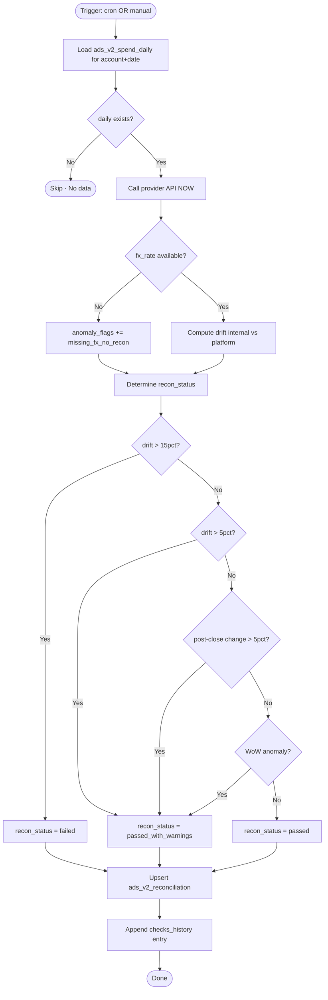

# 🔬 Ads V2 — Reconciliation Workflow

> **الحالة:** مسودة لاعتماد التاجر  
> **التاريخ:** 2026-06-24  
> **الموقع في التدفق:** بين `ads_v2_spend_daily` و `ads_v2_spend_review` (حاجز إلزامي).

---

## 1. الهدف

Reconciliation هو **آخر فحص قبل المراجعة البشرية**. يتأكد أن:

1. ✅ الأرقام الداخلية مطابقة لأرقام المنصة الآن
2. ✅ لا توجد drift غير طبيعية
3. ✅ لا توجد تغيرات غير متوقعة بعد إغلاق اليوم
4. ✅ كل البيانات موجودة (لا حسابات ناقصة)
5. ✅ لا فجوات أو late reporting خطير

إذا فشل أي فحص → السطر **لا يصل** إلى review حتى يُعالَج.

---

## 2. متى يحدث Reconciliation؟

### 2.1 Auto Triggers

| المُحفِّز | متى | الأثر |
|---|---|---|
| **Daily Recon Cron** | كل يوم 01:30 الرياض | فحص آخر 7 أيام لكل حساب نشط |
| **Post-Close Recheck Cron** | كل يوم 02:30 الرياض | إعادة فحص الأيام المغلقة (3-7 أيام مضت) لاكتشاف post-close changes |
| **Sync Finish Hook** | بعد كل sync ناجح | فحص الـ dates التي تأثرت في sync |
| **Weekly Deep Recon** | كل سبت 03:00 | فحص آخر 30 يوم بكامل cross-checks |

### 2.2 Manual Triggers

- `POST /ads-v2/reconciliation/recheck` — التاجر يطلب فحص فوراً لتاريخ/حساب

---

## 3. الـ Workflow الكامل (Mermaid)



---

## 4. الفحوص الستة (Checks)

### Check #1 — Internal vs Platform Drift

```python
internal_native = daily.spend_native
platform_native = call_provider_api(account, date)["spend"]

drift_native = platform_native - internal_native
drift_pct = (drift_native / internal_native) * 100 if internal_native > 0 else 0
```

**العتبات:**
- `drift_pct >= 15%` → `recon_status = failed` + flag `drift_above_15pct`
- `drift_pct >= 5%` → `recon_status = passed_with_warnings` + flag `drift_above_5pct`
- `drift_pct < 5%` → لا تأثير على status

### Check #2 — Post-Close Change

```python
# يقارن آخر checks_history entry بالحالي
last_check = recon.checks_history[-1] if exists else None
if last_check and (now - last_check.at) > 24 hours:
    if abs(daily.spend_native - last_check.spend_daily_native) / last_check.spend_daily_native > 0.05:
        flags.append("post_close_change")
        post_close_delta_pct = compute
```

**العتبات:**
- تغير > 5% بعد إغلاق اليوم → `passed_with_warnings` + flag `post_close_change`
- تغير > 25% → flag `post_close_major_change` + `failed`

### Check #3 — Late Reporting Detection

```python
# إذا spend اليوم زاد بعد > 24 ساعة من نهاية اليوم في timezone الحساب
date_close = end_of_day_in_tz(date, account.timezone)
hours_after_close = (now - date_close).hours

if hours_after_close > 24:
    if drift_native > 0 and drift_pct > 5:
        flags.append("late_reporting")
        late_reporting_detected = True
```

### Check #4 — Week-over-Week Sanity

```python
yesterday = daily for (account, date - 1 day).spend_native
week_ago = daily for (account, date - 7 days).spend_native

if week_ago > 0:
    wow_change_pct = ((today - week_ago) / week_ago) * 100
    
    if wow_change_pct > 200:
        flags.append("wow_spike_above_200pct")
        # Warning فقط، ليس failure
    elif wow_change_pct < -80:
        flags.append("wow_drop_above_80pct")
        # Warning فقط
```

### Check #5 — Currency Mismatch

```python
if daily.currency_native != account.currency_native:
    flags.append("provider_currency_mismatch")
    recon_status = "failed"
    blocking_reasons.append("Provider reports in different currency than account")
```

### Check #6 — Missing Account Data

```python
# لو الحساب اعتاد على ~X spend/يوم لكن اليوم 0
avg_last_7d = avg(daily.spend_native for last 7 days excluding 0)

if avg_last_7d > 100 and daily.spend_native == 0:
    flags.append("zero_spend_unusual")
    # Warning فقط
```

---

## 5. تحديد `recon_status` النهائي

```python
def determine_status(flags: list, drift_pct: float) -> str:
    blocking_flags = {
        "drift_above_15pct",
        "provider_currency_mismatch",
        "post_close_major_change"
    }
    warning_flags = {
        "drift_above_5pct",
        "post_close_change",
        "late_reporting",
        "wow_spike_above_200pct",
        "wow_drop_above_80pct",
        "zero_spend_unusual",
        "missing_fx_no_recon"
    }
    
    if any(f in flags for f in blocking_flags):
        return ("failed", True)   # status, blocks_review
    if any(f in flags for f in warning_flags):
        return ("passed_with_warnings", False)
    return ("passed", False)
```

| Status | يمنع التحويل لـ review؟ | الإجراء في UI |
|---|---|---|
| `passed` | ❌ لا | يمر تلقائياً |
| `passed_with_warnings` | ❌ لا (يمر لكن مع flags) | review يُنشأ بـ `held_*` حسب الـ flags |
| `failed` | ✅ نعم | يحتاج override من owner أو إعادة sync |
| `needs_review` | ✅ نعم (مؤقت) | لمراجعة manual فقط (نادر) |

---

## 6. حالة `failed` (مفصَّل)

عند `recon_status = failed`:

1. **لا** يُنشأ `ads_v2_spend_review`
2. السطر يظهر في **Diagnostics → Failed Reconciliations**
3. التاجر له خياران:
   - **أ.** إعادة sync ثم recheck → ربما الـ drift يُحل تلقائياً
   - **ب.** Override عبر `POST /ads-v2/reconciliation/{id}/override`:
     ```jsonc
     {
       "override_reason": "Confirmed manually in Ads Manager",
       "override_status": "passed"
     }
     ```
     → recon ينتقل لـ `passed` و review يُنشأ مع flag `manual_override`

---

## 7. تفاصيل `checks_history`

كل recon يحتفظ بـ **كل** المحاولات السابقة (append-only) للتعقب الزمني.

```jsonc
"checks_history": [
  {
    "at": "2026-06-24T02:00:00Z",
    "trigger": "daily_recon_cron",
    "spend_daily_native": 654.78,
    "spend_daily_sar": 2456.74,
    "platform_native": 750.00,
    "platform_sar": 2814.00,
    "drift_native": 95.22,
    "drift_pct": 14.55,
    "flags": ["drift_above_5pct"],
    "status": "passed_with_warnings"
  },
  {
    "at": "2026-06-25T02:30:00Z",
    "trigger": "post_close_recheck_cron",
    "spend_daily_native": 720.50,   // تغير بعد إعادة sync
    "spend_daily_sar": 2703.32,
    "platform_native": 750.00,
    "platform_sar": 2814.00,
    "drift_native": 29.50,
    "drift_pct": 3.93,
    "post_close_delta_pct": 10.04,
    "flags": ["post_close_change"],
    "status": "passed_with_warnings"
  }
]
```

التاجر يستطيع رؤية تطور البيانات يومياً.

---

## 8. الـ Promote إلى Review

```python
def promote_to_review(user_id: str, date_from: str, date_to: str):
    """
    Promotes reconciled dailies to the review queue.
    Run daily at 02:30 Riyadh (after Post-Close Recheck).
    """
    
    # Load eligible reconciliations
    candidates = db.ads_v2_reconciliation.find({
        "user_id": user_id,
        "date": {"$gte": date_from, "$lte": date_to},
        "recon_status": {"$in": ["passed", "passed_with_warnings"]},
        "recon_blocked_review": False
    })
    
    for recon in candidates:
        # تخطّى إذا review موجود
        existing = db.ads_v2_spend_review.find_one({
            "user_id": user_id,
            "account_id": recon.account_id,
            "date": recon.date
        })
        if existing:
            continue
        
        # Load daily snapshot
        daily = db.ads_v2_spend_daily.find_one({
            "user_id": user_id,
            "account_id": recon.account_id,
            "date": recon.date
        })
        
        # Determine initial review_status
        review_flags = list(recon.anomaly_flags)
        initial_status = "pending"
        
        if daily.data_health == "missing_fx":
            initial_status = "held_needs_fx"
        elif "drift_above_5pct" in review_flags or "drift_above_15pct" in review_flags:
            initial_status = "held_anomaly"
        elif "post_close_change" in review_flags:
            initial_status = "held_drift"
        elif account.sync_status == "unauthorized":
            initial_status = "held_unauthorized"
        
        # Insert review
        db.ads_v2_spend_review.insert_one({
            "id": uuid4_hex(),
            "user_id": user_id,
            "account_id": recon.account_id,
            "date": recon.date,
            "provider": recon.provider,
            "reconciliation_id": recon.id,
            "spend_native_snapshot": daily.spend_native,
            "currency_native": daily.currency_native,
            "fx_rate_snapshot": daily.fx_rate_to_sar,
            "spend_sar_snapshot": daily.spend_sar,
            "bank_fee_sar_snapshot": daily.bank_fee_sar,
            "gross_sar_snapshot": daily.gross_sar,
            "review_status": initial_status,
            "review_flags": review_flags,
            "idempotency_key": f"ads_v2:{user_id}:{recon.account_id}:{recon.date}",
            "created_at": now_utc_iso()
        })
        
        # Log
        db.ads_v2_review_history.insert_one({
            "review_id": review.id,
            "action": "create",
            "from_status": None,
            "to_status": initial_status,
            "actor_user_id": "system",
            "context": {"reconciliation_id": recon.id, "flags": review_flags},
            "at": now_utc_iso()
        })
```

---

## 9. واجهة المستخدم

### 9.1 Reconciliation Dashboard (`/ads-v2/reconciliation`)

```
┌─ Reconciliation Dashboard · Ads V2 ──────────────────────────────┐
│                                                                    │
│  Filters: [Status ▾] [Account ▾] [Date range] [Has anomalies ☐]  │
│                                                                    │
│  Summary (last 7 days):                                            │
│  ┌─────────┬─────────┬──────────┬────────┐                       │
│  │ Passed  │ Warnings│  Failed  │Override│                        │
│  │   18    │    4    │    2     │   1    │                        │
│  └─────────┴─────────┴──────────┴────────┘                       │
│                                                                    │
│  Failed Reconciliations (need attention):                          │
│  ┌─────────┬──────────┬───────────┬────────┬──────────┬─────────┐│
│  │ Date    │ Account  │ Internal  │Platform│ Drift    │ Action  ││
│  ├─────────┼──────────┼───────────┼────────┼──────────┼─────────┤│
│  │6/23/26 │ الرياض   │   0.00 SAR│ 207.27 │ +∞ %     │[Recheck]││
│  │6/22/26 │ Meta     │ 723.10 SAR│ 510.27 │ -29.43%  │[Recheck]││
│  └─────────┴──────────┴───────────┴────────┴──────────┴─────────┘│
│                                                                    │
│  [ Run Full Recheck (all accounts, last 7 days) ]                 │
└────────────────────────────────────────────────────────────────────┘
```

### 9.2 Reconciliation Detail Page (`/ads-v2/reconciliation/:id`)

```
┌─ Reconciliation · 2026-06-23 · Self Service ────────────────────┐
│ Status: 🟠 Passed with warnings                                   │
│                                                                    │
│ Internal (ads_v2_spend_daily):                                    │
│   654.78 USD → 2456.74 SAR  (fx=3.752 manual)                    │
│                                                                    │
│ Platform (live from API):                                          │
│   750.00 USD → 2814.00 SAR  (refetched: 26h after close)         │
│                                                                    │
│ Drift:                                                             │
│   +95.22 USD (+14.55%)  ⚠️ Above 5% threshold                    │
│   Direction: platform_higher                                       │
│                                                                    │
│ Flags: [late_reporting] [drift_above_5pct]                        │
│                                                                    │
│ Day-over-day:                                                      │
│   Today:        2456.74 SAR                                       │
│   Yesterday:    2100.30 SAR (+17%)                                │
│   Week ago:     1980.50 SAR (+24% WoW)                            │
│                                                                    │
│ Checks History (3 entries):                                        │
│   2026-06-23 22:00  daily_cron      654.78 USD  drift 27%        │
│   2026-06-24 02:00  daily_cron      654.78 USD  drift 14.55%     │
│   2026-06-25 02:30  post_close      720.50 USD  drift 3.93%      │
│                                                                    │
│ [ Recheck Now ]   [ Override (Owner only) ]   [ View in Review ]  │
└────────────────────────────────────────────────────────────────────┘
```

---

## 10. الـ Cron Schedule الكامل (V2)

| الوقت (الرياض) | المهمة | الـ Collection المُعدَّل |
|---|---|---|
| كل ساعة | Sync Cron — يستدعي API لكل حسابات active | spend_raw, spend_daily, sync_runs |
| 01:30 يومياً | Daily Recon — فحص آخر 24 ساعة | reconciliation |
| 02:30 يومياً | Post-Close Recheck — فحص آخر 7 أيام | reconciliation (checks_history) |
| 02:45 يومياً | Promote to Review — تحويل المُحقَّق لـ review | spend_review, review_history |
| 03:00 السبت | Weekly Deep Recon — فحص 30 يوم بكامل cross-checks | reconciliation |
| 05:00 يومياً | OAuth Refresh — تجديد tokens قبل الانتهاء | oauth_credentials |

كل cron يحفظ heartbeat في `cron_runs` (مع type prefix `ads_v2_*`).

---

## 11. التزامن مع المزود (Rate Limits)

| المزود | الحد | استراتيجية |
|---|---|---|
| Meta | 200 calls / hour / app | Token bucket per user |
| Snapchat | 500 calls / minute | Same |
| TikTok | 600 calls / minute | Same |
| Google Ads | Variable (depends on tier) | Same |

عند تجاوز الحد:
- Sync run يُحفَظ بـ `status='partial'`
- الحسابات الناقصة تُعلَّم في `error_per_account`
- Cron التالي يحاول مرة أخرى مع backoff
- التاجر يرى تنبيه في `/ads-v2/diagnostics/sync-health`

---

## 12. ما الذي يفعله Reconciliation لمشكلة "الرياض" بالضبط؟

في وضع V1 الحالي: الرياض = 0 بدون أي مؤشر.

في V2:

1. **Reconciliation يُلاحظ:**
   ```
   spend_daily للرياض = 0
   platform_native للرياض = 207.27 (من API الفعلي)
   drift = +∞ (نسبة بقسمة صفر)
   ```

2. **يضع flags:**
   - `drift_above_15pct`
   - `zero_spend_unusual`
   - `late_reporting` (لو الفجوة بعد > 24 ساعة)

3. **`recon_status = failed`** → السطر **لا** يُحوَّل لـ review

4. **يظهر في Diagnostics → Failed Reconciliations** كأولوية عاجلة

5. **التاجر يرى:**
   - "الرياض: Internal=0, Platform=207.27 → drift +∞"
   - مع زر "Recheck" و "Override"
   - وفي صفحة OAuth Connections: تنبيه "Organization 36e8955e missing valid token"

**هكذا المشكلة تكتشف فوراً ولا تختبئ.**

---

## 13. الأرقام المضمونة (Single Numbers)

بعد Reconciliation:
- ✅ كل تقرير V2 يقرأ من **مصدر موحد** (`ads_v2_data_layer`)
- ✅ كل posting في GL له ما يقابله في `spend_daily`
- ✅ أي drift يُعرَض صراحة في `/ads-v2/reports/reconciliation/`
- ✅ التاجر لا يرى رقماً مختلفاً بين صفحتين أبداً

---

## 14. السيناريوهات الكاملة (5 سيناريوهات للتأكد)

| سيناريو | الحالة | recon_status | review status | الإجراء |
|---|---|---|---|---|
| كل شيء OK | drift < 5% | passed | pending | approve عادي |
| Late reporting بسيط | drift 8% بعد 26h | passed_with_warnings | held_drift | review مع flag |
| Drift كبير | drift 18% | failed | لا review | تنبيه، recheck أو override |
| FX مفقود | لا fx_rate | passed (لو drift OK) | held_needs_fx | edit_fx ثم approve |
| Token منتهٍ | API يرجع 401 | failed | لا review | إعادة OAuth |

---

**✍️ التعديلات المطلوبة:** هل العتبات (5% / 15% / 24h) مناسبة؟ هل الفحوص الستة كافية؟ هل cron schedule مناسب لتوقيت متجرك؟
