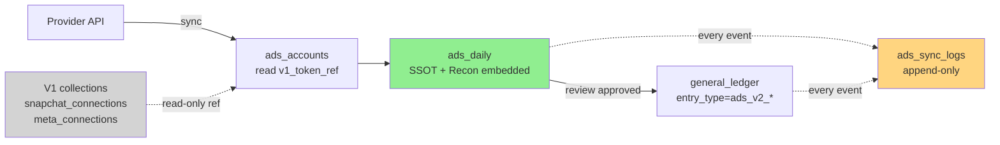

# 📐 Ads V2 — التصميم المُبسَّط النهائي (Simplified Design — Authoritative)

> **الحالة:** مسودة لاعتماد التاجر  
> **التاريخ:** 2026-06-24  
> **يُلغي:** الوثائق السابقة `ADS_V2_01..06` (تبقى للمرجعية فقط)  
> **هدف التصميم:** نظام محاسبي **بسيط وواضح** — لا تعقيد إلا حيث لا غنى عنه.

---

## ⭐ المبدأ الجوهري

**4 collections فقط. مصدر واحد للأرقام. صفحة إعدادات واحدة. لا تعقيد إضافي.**

```
┌──────────────────────────────────────────────────────────────┐
│   Provider APIs (Meta / Snap / TikTok)                       │
│           ▼                                                   │
│   ads_accounts  ←  V1 credentials (read-only reference)      │
│           ▼                                                   │
│   ads_daily     ←  SSOT الوحيد للأرقام                       │
│           ▼                                                   │
│   ads_sync_logs (append-only audit لكل الأحداث)              │
│           ▼                                                   │
│   general_ledger (بعد الاعتماد فقط)                          │
└──────────────────────────────────────────────────────────────┘
```

---

## 1. حماية V1 (هذا أول وأهم بند)

### 1.1 القواعد الحديدية

1. ❌ **لن نحذف** `snapchat_connections` ولا `meta_connections` ولا أي token موجود
2. ❌ **لن نُعدِّل** أي حقل في tokens القديمة
3. ❌ **لن نُعيد OAuth** أو نسأل التاجر عن credentials جديدة قبل الإبلاغ
4. ✅ V2 **يقرأ** tokens القديمة من نفس مكانها بمعرّف مرجعي
5. ✅ إذا انتهت صلاحية token قديم → نُبلغ التاجر ولا نتدخل تلقائياً
6. ✅ V1 cron يستمر بالعمل كما هو (لا توقُف)

### 1.2 آلية الربط المرجعي

في `ads_accounts` نُضيف حقل `v1_token_ref`:

```python
{
  "v1_token_ref": {
    "provider": "snapchat",
    "collection": "snapchat_connections",   # المكان الأصلي
    "user_id": "...",                       # نفس user_id
    "linked_at": "2026-06-25T...",
    "snapshot_only": True                   # نقرأ فقط، لا نعدِّل
  }
}
```

عند استدعاء API:
```python
def get_access_token(account):
    # 1. نقرأ من v1_token_ref بدون تعديل
    v1_doc = await db[account.v1_token_ref.collection].find_one(
        {"user_id": account.v1_token_ref.user_id}
    )
    # 2. نستخدم access_token من V1 doc كما هو
    return v1_doc["access_token"]
    # ⚠️ لا update، لا refresh، لا حذف من V1
```

### 1.3 إذا انتهى Token

V2 يكتشف الانتهاء عبر:
- استجابة 401 من API المزود
- أو `expires_at < now` في V1 doc

عند الاكتشاف:
1. ✅ يُحدِّث `ads_accounts.sync_status = 'token_expired'`
2. ✅ يُسجِّل في `ads_sync_logs(event='token_expired', requires_user_action=True)`
3. ✅ يُظهر تنبيه في صفحة الإعدادات: **"Token لـ Meta منتهٍ — اضغط لإعادة الربط (لكن أبلغني أولاً)"**
4. ❌ لا يستدعي OAuth flow تلقائياً
5. ❌ لا يحذف V1 token

التاجر يقرر متى يعيد الربط — وعند الإعادة، V1 doc يُحدَّث (لأن snapchat_routes/meta_routes الأصلية تتعامل معه) و V2 يقرأ الإصدار الجديد تلقائياً.

---

## 2. الـ Collections الأربعة (Final Schema)

### 2.1 `ads_accounts` — كل ما يخص الحساب في صف واحد

```python
{
  "id": "uuid",
  "user_id": "uuid",
  
  # ── معلومات الحساب الأساسية ──
  "provider": "snapchat",        # meta | snapchat | tiktok | google_ads
  "external_account_id": "cf8ea7c9-...",
  "display_name": "متجر أماسي سعودي",
  "currency_native": "SAR",
  "timezone": "Asia/Riyadh",
  "organization_id": "36e8955e-...",      # nullable
  "organization_name": "Establishment AMASI",
  
  # ── الربط بـ V1 (Read-only reference) ──
  "v1_token_ref": {
    "provider": "snapchat",
    "collection": "snapchat_connections",
    "user_id": "uuid",
    "linked_at": "ISO",
    "snapshot_only": true
  },
  
  # ── العملة وسعر الصرف ──
  "fx_to_sar": {
    "mode": "manual",                    # manual | inherit_from_global
    "rate": 3.752,                       # لو SAR → 1.0
    "effective_from": "2026-06-01",
    "source_note": "SAMA reference June"
  },
  
  # ── العمولة البنكية ──
  "bank_fee": {
    "enabled": false,
    "method": "none",                    # none | pct | flat | pct_plus_flat
    "rate_pct": 0.0,
    "flat_amount_sar": 0.0,
    "note": ""
  },
  
  # ── إعدادات المراجعة ──
  "review_settings": {
    "auto_approve_under_sar": 0,         # 0 = always require approval
    "drift_warning_threshold_pct": 5,
    "drift_block_threshold_pct": 15
  },
  
  # ── حالة المزامنة ──
  "sync_enabled": true,
  "sync_status": "active",               # active | paused | error | token_expired | unauthorized
  "sync_error_message": null,
  "last_sync_started_at": null,
  "last_sync_finished_at": null,
  "last_synced_date": null,
  
  "created_at": "ISO",
  "updated_at": "ISO",
  "soft_deleted": false
}
```

**Indexes:**
- `{user_id, provider, external_account_id}` unique (partial: `soft_deleted=false`)
- `{user_id, sync_status}`

**ملاحظات:**
- ✅ كل إعدادات الحساب في وثيقة واحدة (لا join، لا lookup)
- ✅ يستفيد من V1 tokens بدون نسخها
- ✅ FX و bank_fee و review_settings كلها هنا

### 2.2 `ads_daily` — Source of Truth الوحيد

كل ما يخص يوم × حساب في صف واحد، يشمل:
- البيانات الخام (تجميع)
- النتيجة بـ SAR
- بيانات Reconciliation (drift, platform_reported)
- حالة المراجعة (review_status)
- ربط الترحيل (txn_group_id)

```python
{
  "id": "uuid",
  "user_id": "uuid",
  "account_id": "uuid",                  # FK → ads_accounts
  "provider": "snapchat",
  "date": "2026-06-23",
  
  # ── الأرقام (من المزود) ──
  "spend_native": 654.78,
  "currency_native": "USD",
  "impressions": 250000,
  "clicks": 4500,
  "purchases": 12,
  
  # ── التحويل إلى SAR ──
  "fx_rate": 3.752,                      # snapshot من account.fx_to_sar وقت المزامنة
  "fx_source": "manual",
  "spend_sar": 2456.74,                  # محسوب
  "bank_fee_sar": 70.04,                 # محسوب من account.bank_fee
  "gross_sar": 2526.78,                  # spend_sar + bank_fee_sar
  
  # ── Reconciliation (مدمج هنا — لا collection منفصل) ──
  "platform_reported_native": 750.00,    # nullable لو لم يُعَد الفحص
  "platform_reported_sar": 2814.00,
  "platform_checked_at": "ISO",
  "drift_pct": 14.55,                    # platform vs internal
  "anomaly_flags": ["drift_above_5pct", "late_reporting"],
  
  # ── حالة المراجعة (مدمجة هنا) ──
  "review_status": "pending",
  # pending | approved | rejected | reopened | held_needs_fx
  # held_anomaly | held_unauthorized | held_drift
  
  "review_decided_at": null,
  "review_decided_by": null,
  "review_decision_note": null,
  "review_reopen_count": 0,
  
  # ── ربط الترحيل ──
  "ledger_txn_group_id": null,           # nullable حتى الـ approve
  "ledger_posted_at": null,
  "ledger_reversed": false,
  "ledger_reversal_txn_group_id": null,
  
  # ── Audit & Idempotency ──
  "idempotency_key": "ads_v2:USER:ACCT:2026-06-23",
  "last_synced_at": "ISO",
  "last_recomputed_at": "ISO",
  "sources_count": 1,                    # كم sync run ساهم
  "confidence": "final",                 # provisional | final (< 3 أيام = provisional)
  
  "created_at": "ISO",
  "updated_at": "ISO"
}
```

**Indexes:**
- `{user_id, account_id, date}` unique
- `{user_id, review_status, date:-1}`
- `{user_id, date:-1, provider}`
- `{idempotency_key}` unique

**ملاحظات حاسمة:**
- ✅ **هذا الجدول هو SSOT الأرقام**. لا تقرير في V2 يقرأ من أي مكان آخر للأرقام (إلا GL للأرصدة)
- ✅ Reconciliation **ليس** collection مستقل — مدمج هنا (drift, platform_*, anomaly_flags)
- ✅ Review state مدمج هنا — لا جدول `spend_review` منفصل
- ✅ Idempotency يحمي من double-post
- ✅ كل recompute يُحدِّث نفس الصف (upsert)

### 2.3 `ads_sync_logs` — Audit Log موحَّد (append-only)

كل حدث يُسجَّل هنا. يدمج: sync runs + review actions + posting + reversal + token alerts.

```python
{
  "id": "uuid",
  "user_id": "uuid",
  "account_id": "uuid",                  # nullable لو حدث عام
  "date": "2026-06-23",                  # nullable لو حدث على مستوى الحساب
  
  "event": "sync_run",
  # sync_run | sync_failed
  # review_approved | review_rejected | review_reopened | review_held
  # ledger_posted | ledger_reversed
  # token_expired | token_renewed
  # account_created | account_modified | account_disabled
  # fx_changed | bank_fee_changed
  # reconciliation_checked
  
  "actor_user_id": "uuid",               # null = system
  "actor_email": null,                   # للعرض
  
  # ── تفاصيل الحدث (متغيرة حسب event) ──
  "details": {
    "spend_native": 654.78,              # لـ sync_run
    "rows_affected": 1,
    "txn_group_id": "...",               # لـ ledger_posted
    "from_status": "pending",            # لـ review_*
    "to_status": "approved",
    "drift_pct": 14.55,                  # لـ reconciliation_checked
    "anomaly_flags": [...]
  },
  
  "error_code": null,                    # لو فشل
  "error_message": null,
  
  "ip_address": null,                    # للـ actions اليدوية
  "at": "ISO"                            # timestamp رئيسي
}
```

**Indexes:**
- `{user_id, at:-1}`
- `{user_id, account_id, at:-1}`
- `{user_id, event, at:-1}`
- `{user_id, date, event}` لاستعلامات per-day

**ملاحظات:**
- ✅ **append-only** — لا تعديل، لا حذف
- ✅ **بديل** لـ 4 جداول كانت في التصميم القديم (sync_runs + review_history + ledger_postings + reversals)
- ✅ بحث سريع بـ event للوصول لأي تاريخ
- ✅ يُستخدم لـ "كل النشاط" في صفحة Detail

### 2.4 `general_ledger` (الحالي بدون تعديل)

V2 يكتب فيه بـ `entry_type` مميز:
- `ads_v2_expense` (debit)
- `ads_v2_debt_credit` (credit)
- `ads_v2_bank_fee` (debit)

كل قيد له `metadata.source='ads_v2'` و `metadata.ads_daily_id` (يربطه بصفه في `ads_daily`).

---

## 3. صفحة إعدادات الإعلانات الموحَّدة

### 3.1 المسار

`/ads-v2/settings` — **صفحة واحدة بـ 4 تبويبات**

### 3.2 التبويبات

#### Tab 1: "الحسابات والربط"

```
┌─ إعدادات الإعلانات · الحسابات والربط ──────────────────┐
│                                                          │
│  Snapchat 🔗 [Token: ✓ Active · last refresh: 5d ago]   │
│  ┌────────────────────────────────────────────────────┐│
│  │ متجر أماسي  Self Service · USD · Asia/LA           ││
│  │   Bank fee: pct 2.85% · sync: ✓ · last: 2026-06-23 ││
│  │   [⚙️ تعديل] [⏸ تعطيل]                            ││
│  └────────────────────────────────────────────────────┘│
│  ┌────────────────────────────────────────────────────┐│
│  │ متجر أماسي سعودي (الرياض) · SAR · Asia/Riyadh      ││
│  │   ⚠️ Token Required: Organization مختلفة            ││
│  │   [📞 أبلغني للحصول على Token جديد]                ││
│  └────────────────────────────────────────────────────┘│
│                                                          │
│  Meta 🔗 [Token: ✓ Active]                              │
│  ┌────────────────────────────────────────────────────┐│
│  │ Meta · SAR · Asia/Riyadh                            ││
│  │   Bank fee: none · sync: ✓ · last: 2026-06-23      ││
│  │   [⚙️ تعديل] [⏸ تعطيل]                            ││
│  └────────────────────────────────────────────────────┘│
│                                                          │
│  TikTok 🔗 [Token: ❌ Not connected]                    │
│  [+ اربط TikTok عندما يصبح متاحاً]                     │
│                                                          │
└──────────────────────────────────────────────────────────┘
```

#### Tab 2: "العملة وسعر الصرف"

```
┌─ إعدادات الإعلانات · العملات ──────────────────────────┐
│                                                          │
│  USD → SAR                                              │
│  ┌────────────────────────────────────────────────────┐│
│  │ Rate: 3.752    From: 2026-06-01    Source: manual ││
│  │ [✎ تعديل]                                          ││
│  └────────────────────────────────────────────────────┘│
│  ┌────────────────────────────────────────────────────┐│
│  │ Rate: 3.745    From: 2026-05-01 → 2026-05-31      ││
│  │ Status: Archived                                    ││
│  └────────────────────────────────────────────────────┘│
│                                                          │
│  AED → SAR  (لم يُضَف بعد)  [+ أضف]                    │
│  QAR → SAR  (لم يُضَف بعد)  [+ أضف]                    │
│  EUR → SAR  (لم يُضَف بعد)  [+ أضف]                    │
│                                                          │
└──────────────────────────────────────────────────────────┘
```

#### Tab 3: "العمولات البنكية"

كل حساب له قسم — أو القائمة الموحدة:

```
┌─ إعدادات الإعلانات · العمولات البنكية ─────────────────┐
│                                                          │
│  Self Service (Snap)                                    │
│   ☑ Bank Fee Enabled                                   │
│   Method: ◉ Percentage   ○ Flat   ○ Both              │
│   Rate %: 2.85%                                         │
│   Flat: -                                               │
│   Note: "Visa cross-border markup"                      │
│   [حفظ]                                                 │
│                                                          │
│  Meta                                                    │
│   ☐ Bank Fee Enabled                                   │
│                                                          │
│  الرياض (Snap)                                          │
│   ☑ Bank Fee Enabled                                   │
│   Method: ◉ Both                                        │
│   Rate %: 0.50%                                         │
│   Flat: 5 SAR                                           │
│   [حفظ]                                                 │
│                                                          │
└──────────────────────────────────────────────────────────┘
```

#### Tab 4: "إعدادات المراجعة"

```
┌─ إعدادات الإعلانات · المراجعة ─────────────────────────┐
│                                                          │
│  Auto-approve threshold: 0 SAR                          │
│  (0 = تتطلب اعتماد يدوي لكل المبالغ)                   │
│                                                          │
│  Drift warning threshold: 5%                            │
│  Drift block threshold: 15%                             │
│                                                          │
│  (هذه الإعدادات تُطبَّق على كل الحسابات)               │
│                                                          │
└──────────────────────────────────────────────────────────┘
```

### 3.3 ما الذي **أُلغي**

| كان | أُلغي |
|---|---|
| 11 صفحة (Dashboard + Accounts + Connections + Sync Runs + Currency + Review + Postings + Reports + Reconciliation + Diagnostics) | 5 صفحات فقط |
| 3 صفحات إعدادات منفصلة | صفحة واحدة بتبويبات |

---

## 4. الصفحات الخمس النهائية

| الصفحة | المسار | الغرض |
|---|---|---|
| **Dashboard** | `/ads-v2` | بطاقات: spend اليوم/الأسبوع/الشهر، عدد reviews pending، حالة المزامنة، أي drift ≥ 5% |
| **Review Queue** | `/ads-v2/review` | الجدول الرئيسي للمراجعة (فردي + bulk) |
| **Daily Report** | `/ads-v2/report` | تقرير by-day / by-account / by-provider (tab واحد بثلاث تجميعات) |
| **Activity Log** | `/ads-v2/activity` | عرض `ads_sync_logs` بفلتر event/date/account |
| **Settings** | `/ads-v2/settings` | 4 تبويبات (الحسابات، العملات، العمولات، المراجعة) |

كل الصفحات تستهلك `ads_v2_data_layer`. لا قراءة Mongo مباشرة من ملف صفحة.

---

## 5. الـ API Contract المُبسَّط

### 5.1 إجمالي endpoints: 20 (بدلاً من 50+)

```
# Settings (CRUD واحد لكل شيء)
GET    /ads-v2/settings                  # كل الإعدادات في response واحد
PATCH  /ads-v2/settings/accounts/{id}    # تعديل حساب (FX + bank_fee + sync + review_settings)
POST   /ads-v2/settings/accounts         # إضافة حساب يدوي
DELETE /ads-v2/settings/accounts/{id}    # soft delete
POST   /ads-v2/settings/accounts/discover # جلب الحسابات المتاحة من V1 tokens
POST   /ads-v2/settings/fx               # إضافة/تحديث سعر صرف
POST   /ads-v2/settings/accounts/{id}/relink-v1  # ربط مرجعي بـ V1 token

# Sync
POST   /ads-v2/sync/run                  # manual trigger (account+date range)
GET    /ads-v2/sync/status               # حالة المزامنة الحالية

# Review
GET    /ads-v2/review                    # قائمة المراجعة بفلاتر
POST   /ads-v2/review/{id}/approve       # فردي
POST   /ads-v2/review/{id}/reject        # فردي
POST   /ads-v2/review/{id}/reopen        # من rejected
POST   /ads-v2/review/{id}/edit-fx       # تعديل fx قبل approve
POST   /ads-v2/review/bulk               # bulk action: { ids, action, note }

# Ledger interactions
POST   /ads-v2/ledger/reverse/{daily_id} # عكس قيد

# Reports
GET    /ads-v2/report                    # by-day / by-account / by-provider (query=group_by)
GET    /ads-v2/report/debt               # مديونية الحسابات (من GL)
GET    /ads-v2/report/v1-vs-v2           # مقارنة في Phase A

# Activity
GET    /ads-v2/activity                  # logs بفلاتر
```

### 5.2 ملاحظة: Reconciliation كـ side-effect

لا endpoint مستقل لـ reconciliation. **يحدث تلقائياً** كجزء من sync:
1. Sync يجلب الأرقام من API
2. في نفس الـ flow: يقارن مع آخر spend_daily ويُحدِّث drift fields
3. يضع anomaly_flags لو لزم
4. لا يحتاج endpoint منفصل

لو التاجر يريد recheck يدوي: `POST /ads-v2/sync/run` مع `force_recheck=true`.

---

## 6. Posting Workflow (بدون Transactions الإلزامية)

### 6.1 المشكلة

Standalone MongoDB لا يدعم multi-document transactions. الحل: **Idempotent Writes + Verify-Read pattern**.

### 6.2 الـ Approach

```python
async def approve_daily(daily_id: str, actor: User):
    daily = await db.ads_daily.find_one({"id": daily_id})
    
    # ── 1. Pre-checks ──
    if daily.review_status == "approved":
        return existing_posting(daily.ledger_txn_group_id)  # idempotent
    assert daily.review_status in ALLOWED_STATES
    
    # ── 2. Idempotency check ──
    if await db.general_ledger.find_one({
        "metadata.idempotency_key": daily.idempotency_key,
        "status": "posted"
    }):
        # GL له القيد بالفعل — نُحدِّث daily ونرجع
        await db.ads_daily.update_one(
            {"id": daily_id},
            {"$set": {"review_status": "approved", ...}}
        )
        return
    
    # ── 3. Build legs (في الذاكرة، لا writes بعد) ──
    txn_group_id = uuid4()
    legs = build_legs(daily, txn_group_id)
    validate_double_entry(legs)  # debit == credit
    
    # ── 4. Write to GL with batch insert ──
    # MongoDB insert_many هي atomic داخل وثيقة واحدة، لكن نعتمد على
    # unique index على idempotency_key لمنع double-write.
    try:
        await db.general_ledger.insert_many(legs, ordered=True)
    except DuplicateKeyError:
        # سباق race condition — قيد آخر سبقنا
        return await _handle_duplicate(daily, txn_group_id)
    
    # ── 5. Verify all legs landed ──
    landed = await db.general_ledger.count_documents(
        {"txn_group_id": txn_group_id}
    )
    if landed != len(legs):
        # خطأ نادر — نسجِّل alert ولا نُحدِّث daily
        await db.ads_sync_logs.insert_one({
            "event": "ledger_post_partial_failure",
            "details": {"expected": len(legs), "landed": landed},
            ...
        })
        raise PartialPostingError()
    
    # ── 6. Update daily ──
    await db.ads_daily.update_one(
        {"id": daily_id, "review_status": {"$ne": "approved"}},  # CAS
        {"$set": {
            "review_status": "approved",
            "review_decided_at": now(),
            "review_decided_by": actor.id,
            "ledger_txn_group_id": txn_group_id,
            "ledger_posted_at": now()
        }}
    )
    
    # ── 7. Log event ──
    await db.ads_sync_logs.insert_one({
        "event": "ledger_posted",
        "details": {"txn_group_id": txn_group_id, "amount": daily.gross_sar},
        ...
    })
```

**ضمانات بدون transactions:**
- ✅ `idempotency_key` unique → لا double-post
- ✅ `insert_many(ordered=True)` → كل الـ legs أو لا شيء (إذا فشل أولها، الباقي لا يُكتب)
- ✅ Verify-after-write يكشف الـ partial writes
- ✅ CAS update على daily يمنع double-update
- ✅ كل الأخطاء النادرة تُسجَّل في activity للمعالجة اليدوية

### 6.3 ولو كان Replica Set؟

سنستخدم `with_transaction()` كـ optimization (تسريع + ضمان قوي). الكود يكتشف القدرة تلقائياً:

```python
def _supports_transactions(db):
    return db.client.options.replica_set is not None

async def approve_daily(...):
    if _supports_transactions(db):
        async with db.client.start_session() as session:
            async with session.start_transaction():
                # نفس الكود لكن مع session
                ...
    else:
        # نفس الكود بدون session (Idempotent + Verify pattern)
        ...
```

**النتيجة:** يعمل على كلا البيئتين بدون تغيير معماري.

---

## 7. Reconciliation كطبقة تحقق فقط (مدمجة)

### 7.1 مكانها

داخل `sync run` لكل (account, date). تُحدِّث `ads_daily` بنفس الـ run:

```python
async def sync_one_day(account, date):
    # 1. جلب من المزود
    platform_data = await fetch_from_provider(account, date)
    
    # 2. حساب القيم
    spend_native = platform_data["spend"]
    fx_rate = lookup_fx(account, date)
    spend_sar = spend_native * fx_rate
    bank_fee_sar = calc_bank_fee(account, spend_sar)
    
    # 3. Reconciliation (مدمجة هنا)
    previous = await db.ads_daily.find_one({...})
    drift_pct = compute_drift(previous, platform_data) if previous else 0
    flags = []
    if drift_pct > account.review_settings.drift_block_threshold_pct:
        flags.append("drift_above_15pct")
        review_status_initial = "held_anomaly"
    elif drift_pct > account.review_settings.drift_warning_threshold_pct:
        flags.append("drift_above_5pct")
        review_status_initial = "held_drift"  # warning فقط
    
    # 4. Upsert daily
    await db.ads_daily.update_one(
        {"user_id": ..., "account_id": ..., "date": date},
        {"$set": {
            "spend_native": spend_native,
            "spend_sar": spend_sar,
            "bank_fee_sar": bank_fee_sar,
            "gross_sar": spend_sar + bank_fee_sar,
            "fx_rate": fx_rate,
            "platform_reported_native": spend_native,  # نفسها قبل أي drift
            "platform_checked_at": now(),
            "drift_pct": drift_pct,
            "anomaly_flags": flags,
            "review_status": review_status_initial if not previous else previous.review_status,
            "last_synced_at": now()
        },
         "$setOnInsert": {
            "idempotency_key": f"ads_v2:{user_id}:{account_id}:{date}",
            "review_status": review_status_initial,
            ...
        }},
        upsert=True
    )
    
    # 5. Log
    await db.ads_sync_logs.insert_one({
        "event": "sync_run",
        "details": {"spend": spend_sar, "drift_pct": drift_pct, "flags": flags}
    })
```

### 7.2 لا collection منفصل

كل بيانات Reconciliation موجودة في `ads_daily`:
- `platform_reported_native` / `platform_reported_sar`
- `platform_checked_at`
- `drift_pct`
- `anomaly_flags`

تاريخ التغييرات في `ads_sync_logs` (event=`sync_run` و event=`reconciliation_checked`).

### 7.3 العرض في UI

في صفحة Review، كل صف يُظهر:
```
2026-06-23  Self Svc  654.78 USD = 2456.74 SAR
            Platform now: 750.00 USD (drift +14.5% ⚠️)
            Flags: late_reporting, drift_above_5pct
            Status: held_drift
            [Approve] [Reject] [Recheck]
```

---

## 8. مخطط البيانات المُختصر (Mermaid)



---

## 9. الفروقات بين هذا التصميم والتصميم القديم

| البُعد | التصميم القديم | التصميم المُبسَّط (الحالي) |
|---|---|---|
| عدد Collections | 12 | **4** |
| عدد الصفحات | 11 | **5** |
| عدد API endpoints | 50+ | **20** |
| OAuth credentials | جدول منفصل مع نسخ tokens | **مرجع لـ V1** بدون نسخ |
| Spend raw / daily / review | 3 جداول منفصلة | **جدول واحد** (`ads_daily`) |
| Sync runs / postings / reversals / review history | 4 جداول | **جدول واحد** (`ads_sync_logs`) |
| Reconciliation | جدول منفصل + cron + endpoints | **مدمج في sync** + حقول في `ads_daily` |
| FX & Bank fee settings | جداول منفصلة | **مدمجة في `ads_accounts`** |
| Transactions | إلزامية (Replica Set required) | **اختيارية** (يعمل على Standalone) |
| الإعدادات في UI | 3 صفحات منفصلة | **صفحة واحدة بـ 4 تبويبات** |
| مرجع V1 | غير محدد | **آمن: read-only reference, no modification** |

---

## 10. الخطة العملية المُبسَّطة

### مرحلة 0 — التأسيس (2-3 أيام)
- إنشاء `ads_accounts`, `ads_daily`, `ads_sync_logs` (3 ملفات schema)
- بناء صفحة Settings (4 تبويبات)
- بناء API: GET/PATCH `/ads-v2/settings`
- بناء discovery: قراءة tokens من V1 وإظهار الحسابات المتاحة
- **اختبار:** التاجر يستطيع رؤية كل حساباته (من V1 tokens) وضبط FX + bank_fee

### مرحلة 1 — المزامنة + Reconciliation (3-4 أيام)
- بناء adapters لكل مزود (Meta, Snap, TikTok)
- استخدام `v1_token_ref` لجلب tokens
- بناء `sync_one_day` مع Reconciliation مدمج
- بناء scheduler V2 مع heartbeat في `ads_sync_logs`
- **اختبار:** `ads_daily` يمتلئ بأرقام صحيحة لـ 7 أيام آخرة، drift مكشوف

### مرحلة 2 — المراجعة والترحيل (3 أيام)
- بناء صفحة Review (فردي + bulk)
- بناء approve/reject/reopen مع Idempotent posting
- بناء Reverse
- **اختبار:** يوم كامل من Meta + Snap يصل إلى GL بعد موافقة التاجر

### مرحلة 3 — التقارير (2 يوم)
- بناء `ads_v2_data_layer.py` بدوال الـ SSOT
- بناء صفحة Report (3 تجميعات)
- بناء صفحة Activity Log
- بناء Dashboard
- **اختبار:** Contract tests (sum_by_day == sum_by_account == sum_by_provider)

### مرحلة 4 — التحقق والانتقال (أسبوع كامل بدون لمس V1)
- التاجر يقارن V1 و V2 يومياً (صفحة `/ads-v2/report/v1-vs-v2`)
- V1 cron يستمر يعمل
- V2 cron يعمل بالتوازي
- بعد أسبوع من المطابقة → موافقة التاجر النهائية على الانتقال
- **حتى ذلك الحين V1 لا يتأثر إطلاقاً**

**إجمالي: ~10-12 يوم عمل بدلاً من 14-18.**

---

## 11. ضمانات قبل البدء

أتعهَّد بـ:

1. ❌ **لا** سأحذف أي token من V1
2. ❌ **لا** سأُعدِّل `snapchat_connections` أو `meta_connections` أو أي V1 doc
3. ❌ **لا** سأُعطِّل V1 cron قبل موافقتك بعد أسبوع مطابقة
4. ❌ **لا** سأبدأ OAuth جديد قبل إبلاغك
5. ✅ V2 يقرأ V1 tokens فقط (read-only reference)
6. ✅ كل خطأ في token = تنبيه + انتظار قرارك
7. ✅ V1 و V2 يعملان بالتوازي طوال فترة الاختبار
8. ✅ بعد أسبوع مطابقة، الانتقال يحتاج موافقة كتابية صريحة منك

---

## 12. سؤالك النهائي

**هل تعتمد هذا التصميم المُبسَّط للبدء بالمرحلة 0؟**

- ✅ **نعم، ابدأ المرحلة 0** → سأبني `ads_accounts` + `ads_daily` + `ads_sync_logs` + صفحة Settings خلال 2-3 أيام، ثم نراجع معاً قبل الانتقال للمرحلة 1.
- ✏️ **نعم، لكن مع تعديل صغير** → حدد التعديل وسأُحدِّث الوثيقة.
- ⏸ **انتظر، أحتاج وقت للمراجعة** → خذ وقتك، الوثيقة محفوظة في `/app/memory/ADS_V2_FINAL_DESIGN.md`.

**ملاحظة:** هذه الوثيقة تُلغي التصميم القديم (ADS_V2_01..06). إذا اعتمدت، سنعمل بها فقط.
